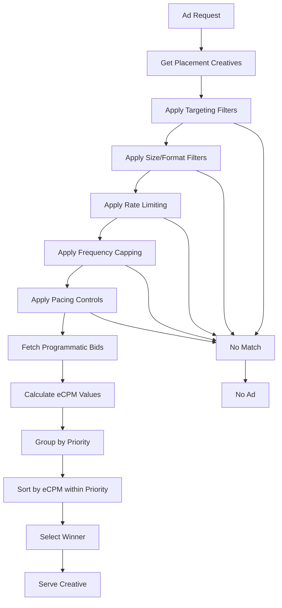

# Ad Decisioning Algorithm

This document explains how the ad server selects which creative to serve for any given ad request. The system uses a **priority-first, eCPM-optimized** approach where line items compete within priority tiers, then by effective cost per mille (eCPM).

## Decisioning Flow

## Optimized Single-Pass Filtering

The ad server uses an **optimized single-pass filtering system** that evaluates all criteria in one efficient loop rather than making multiple sequential passes through the creative dataset.

### Filter Criteria

Creatives must pass **all** filters to remain eligible:

1. **Targeting Match**: Device, geo, OS, browser, custom key-values
2. **Size/Format**: Dimensions and format compatibility
3. **Rate Limiting**: QPS limits for direct line items (optional)
4. **Frequency Capping**: Per-user impression limits
5. **Pacing Controls**: Daily budget and impression management (ASAP/Even/PID)

### Implementation Details

- **Single Memory Pass**: Processes all creatives in one optimized loop
- **Batch Redis Operations**: Frequency and pacing checks use efficient batching
- **Early Termination**: Stops processing as soon as a creative fails any filter
- **Cache-Friendly**: Sequential memory access patterns improve CPU cache utilization

See individual filter documentation for detailed logic.

## eCPM Calculation

How different billing models calculate eCPM for ranking:

| Billing Model | eCPM Calculation |
|---------------|------------------|
| **CPM** | Direct value from line item configuration |
| **CPC** | Base eCPM × CTR boost multiplier (if optimization enabled) |
| **Programmatic** | Bid price from external endpoint response |

## Ranking and Selection

### Priority-First Ranking
1. **Group by Priority**: High → Medium → Low (configurable)
2. **Sort within Priority**: By eCPM descending
3. **Select Winner**: First creative from ranked list

### Competitive Dynamics
- **Priority trumps eCPM**: High-priority low-eCPM beats medium-priority high-eCPM
- **eCPM decides ties**: Highest eCPM wins within same priority
- **CTR optimization advantage**: CPC line items can boost eCPM via predicted click-through rates

## Key Decision Points

### When Line Items Compete
- Same placement and targeting criteria
- Pass all filtering requirements
- Ranked by priority first, then eCPM

### When Line Items Don't Compete
- Failed targeting match
- Blocked by rate limiting or frequency caps
- Exceeded pacing/budget limits
- Programmatic bid timeout or failure

## External Dependencies

- **CTR Optimization Service**: Provides eCPM boost for CPC line items (100ms timeout)
- **Programmatic Endpoints**: External bid requests for programmatic line items (800ms timeout)
- **Redis**: Frequency capping, pacing, and rate limiting state

Both external services use graceful degradation - ad serving continues if they fail.

## Debug Mode

Add `debug=1` to ad requests to see intermediate results:
- Creative IDs after each filter
- eCPM calculations
- Final ranking order
- Elimination reasons