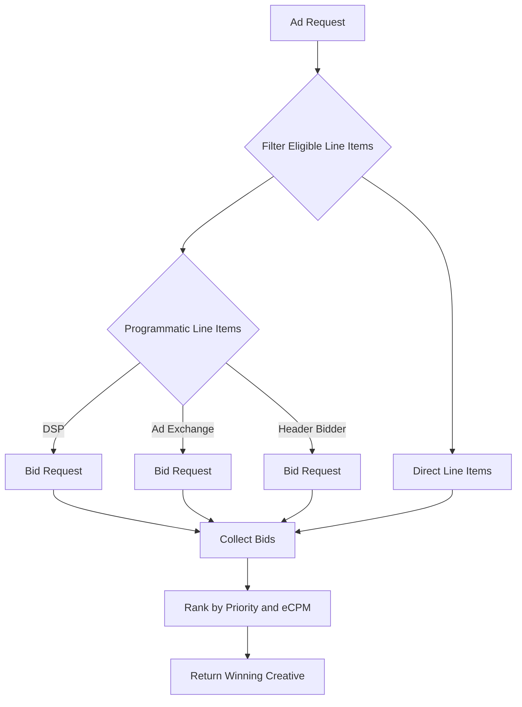

# Programmatic Demand

This guide explains how programmatic line items integrate with the ad server and compete with direct campaigns. It also shows an example configuration and how to test with the optional Prebid Server.

## Overview

Programmatic line items fetch bids from an external endpoint. During ad selection the server
queries these endpoints in parallel, then ranks the returned prices against direct line items using
normalised eCPM. This allows external demand to compete fairly with deals you sell directly.

## Line Item Fields

A programmatic line item uses the standard line item structure with two key fields:

```go
Type     string // set to "programmatic"
Endpoint string // URL to request an OpenRTB bid
```

Other attributes such as targeting, pacing and budget work the same as direct deals. Here is a
JSON example:

```json
{
  "id": 42,
  "campaign_id": 10,
  "publisher_id": 7,
  "name": "Header Bidder",
  "type": "programmatic",
  "endpoint": "http://prebid-server:8000/openrtb2/auction",
  "budget_type": "cpm",
  "cpm": 0,
  "priority": "medium"
}
```

## Bidding Flow



1. The server filters line items by targeting, pacing and caps.
2. For each programmatic item it calls the `Endpoint` using the OpenRTB request.
3. Returned bids are merged with direct line items and ranked by priority then price.
4. The highest ranked creative is served and tracking URLs are generated.

## Setting Up With Direct Demand

Run `docker compose --profile prebid up` to start the optional Prebid Server at `http://localhost:8060`.
Create a line item like the JSON above and it will compete with any direct line items targeting the same request.
Bids that clear your floors simply override the `ECPM` of the programmatic line item when ranking.

During development you can also point the line item to `http://localhost:8787/test/bid` which always
returns a fixed bid for testing.
