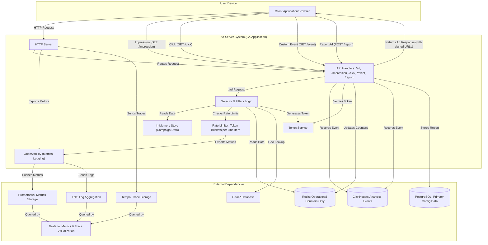

# Systems Architecture

This document provides a deeper look at how the ad server is structured and how requests flow through the system. It is intended for readers who are new to building ad servers and want to understand the moving pieces in this codebase.

## Components

The server is a Go application that relies on a small set of external services:

- **PostgreSQL** serves as the primary source of truth for storing placements, creatives, line items, and campaigns.
- **Redis** is used for operational data only, including frequency capping, pacing counters, and rate limiting.
- **In-Memory Store** loads all campaign data from PostgreSQL into memory on startup for fast access in this single-instance architecture.
- **ClickHouse** stores analytics events such as impressions, clicks and custom events. The table schema lives in `internal/analytics/clickhouse.go`.
- **CTR Predictor Service** (optional) provides machine learning-based CTR predictions for CPC line item optimization using logistic regression trained on historical click data.
- **GeoIP database** provides country and region lookup based on the user's IP address. The repository includes a GeoLite2 database under `data/`.
- **Rate Limiter** uses in-memory token buckets to prevent request floods on direct line items. Each line item gets its own bucket with configurable capacity and refill rate.
- **Distributed Tracing** uses OpenTelemetry to instrument HTTP requests, database queries, and Redis operations. Traces are sent to Grafana Tempo with automatic trace ID injection into all application logs.
- **Prometheus** collects metrics exported by `internal/observability`, including rate limiting statistics.
- **Grafana** visualises metrics collected by Prometheus and provides trace exploration via Tempo integration. Trace-to-logs correlation allows seamless debugging from traces to related log entries.

## Startup Sequence

1. `cmd/server/main.go` initialises logging and reads environment variables.
2. If tracing is enabled (`TRACING_ENABLED=true`), OpenTelemetry is initialized with Tempo endpoint configuration and automatic instrumentation is applied to HTTP handlers, database connections, and Redis operations.
3. Connections are established to Redis, ClickHouse and Postgres with OpenTelemetry instrumentation applied.
4. The `InMemoryAdDataStore` is initialized.
5. Campaigns, line items, and placements are loaded from Postgres and stored in memory.
6. The rate limiter is configured with token bucket parameters from environment variables.
7. The HTTP server is started with handlers defined in `internal/api` and middleware chain including automatic trace ID injection into all logs.

## Ad Request Flow

1. A client sends a `POST /ad` request in a minimal OpenRTB format.
2. `GetAdHandler` parses the request, resolves the `TargetingContext` using the user agent and GeoIP lookup and records an `ad_request` analytics event.
3. The pluggable `selectors.Selector` (by default `RuleBasedSelector`) receives the request parameters along with the in-memory `AdDataStore`.
4. The selector applies a series of filters defined in `internal/logic/filters`:
   - targeting checks (device, OS, browser, geo and custom key/values)
   - placement size and format checks
   - line item active state
   - rate limiting for direct line items (token bucket algorithm)
   - frequency capping and dual-counter pacing using Redis (uses pipeline batching for efficiency)
5. For CPC line items with CTR optimization enabled, the system queries the CTR predictor service for context-aware click probability predictions and applies boost multipliers to eCPM calculations.
6. Remaining candidates are ranked by priority and eCPM. Programmatic line items can fetch external bids concurrently.
7. The winning creative is wrapped in an `OpenRTBResponse`. A signed token is generated via `internal/token` and embedded in the impression, click and event URLs.
8. An `ad_served` analytics event is written to ClickHouse, the serve counter is immediately incremented in Redis for pacing decisions, and the response is returned to the client. Optional debug traces show intermediate creative IDs when `debug=1` is enabled.

## Impression and Click Tracking

- **`GET /impression`** verifies the token, records an `impression` event in ClickHouse and updates the impression counter in Redis for accurate billing (separate from the serve counter used for pacing). A 1&times;1 GIF is returned.
- **`GET /click`** performs the same token verification, records a `click` event and updates spend for CPC line items.

## Custom Events

`GET /event?type=...` allows publishers to track additional engagement signals. The endpoint verifies the token, checks the event type against the allowlist in `internal/api/event.go` and records the event. Redis counters are incremented for the line item so pacing or billing logic can consume them later.

## Ad Reporting

`POST /report` enables users to flag problematic ads for moderation. The endpoint verifies the token, validates the report reason, and stores the report in PostgreSQL. This publisher-first feature gives publishers direct control over ad quality and user experience. Analytics events are also recorded in ClickHouse for monitoring report trends and patterns.

## Data Synchronization

The single-instance architecture uses an in-memory store that can be refreshed from PostgreSQL:
- The `/reload` endpoint refreshes the in-memory data from PostgreSQL at runtime.
- An automatic, periodic reload can be configured via the `RELOAD_INTERVAL` environment variable.

## High Level Diagram

**Request Flow:**

1. **Ad Request** → Parse → GeoIP lookup → Selector (reads from AdDataStore) applies filters → Generate signed URLs → Return ad
2. **Tracking** → Verify token → Record event in ClickHouse → Update Redis counters  
3. **Reporting** → Verify token → Store report in PostgreSQL → Record analytics event
4. **Data Sync** → Use `/reload` endpoint or automatic reloads via `RELOAD_INTERVAL`.
5. **Observability** → Export metrics to Prometheus → Send traces to Tempo → All logs include trace IDs → Visualize in Grafana with trace-to-logs correlation
